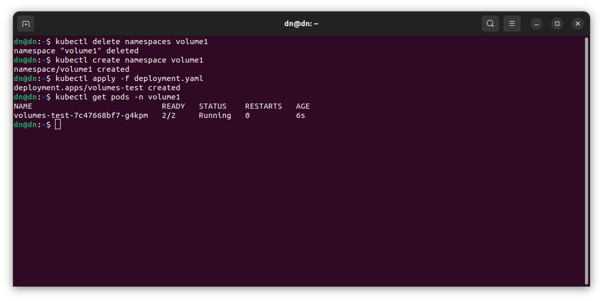

# Никоноров Денис - FOPS-8
# Домашнее задание к занятию «Хранение в K8s. Часть 1»

### Задание 1 

**Что нужно сделать**

Создать Deployment приложения, состоящего из двух контейнеров и обменивающихся данными.

1. Создать Deployment приложения, состоящего из контейнеров busybox и multitool.
2. Сделать так, чтобы busybox писал каждые пять секунд в некий файл в общей директории.
3. Обеспечить возможность чтения файла контейнером multitool.
4. Продемонстрировать, что multitool может читать файл, который периодоически обновляется.
5. Предоставить манифесты Deployment в решении, а также скриншоты или вывод команды из п. 4.

------

### Задание 2

**Что нужно сделать**

Создать DaemonSet приложения, которое может прочитать логи ноды.

1. Создать DaemonSet приложения, состоящего из multitool.
2. Обеспечить возможность чтения файла `/var/log/syslog` кластера MicroK8S.
3. Продемонстрировать возможность чтения файла изнутри пода.
4. Предоставить манифесты Deployment, а также скриншоты или вывод команды из п. 2.

------

### Решение задания 1.

Создан namespace volume1.
Написан манифест [deployment](/deployment.yaml). Что бы busybox писал данные каждые 5 сек в файлв общей директории, использована команда создающую общую директорию и общий файл. Потом в созданный файл каждые 5 сек будет записываться message "Test message".
Для того чтобы multitool читал файл, в манифесте указан общую директорию с контейнером busybox. Чтение будет с помощью `tail`.
Запущен данный манифест

Все запустилось подключаемся к контейнерам для проверки.

Из обоих контейнеров пода файл доступен и вносятся данные каждые 5 сек.

У контейнера multitool можно посмотреть лог читает ли файл.

### Решение задания 2

Написан манифест [daemonset](/daemonset.yaml) состоящего из multitool. Применил мманифест и проверяю.

Для возможности чтения файла `/var/log/syslog` кластера Microk8s внутри контейнера нужно использовать параметр subPath, который позволит монтировать не всю директорию `/var/log` с машины кластера Microk8s, именно один файл syslog. Также нужен параметр readOnly, что ижбежать проблем с доступом к файлу syslog.

Проверка

Видно что в поде присутствует дерктория `/nodes-logs/ с файлом syslog, который примонтирован из машины кластера Microk8s.